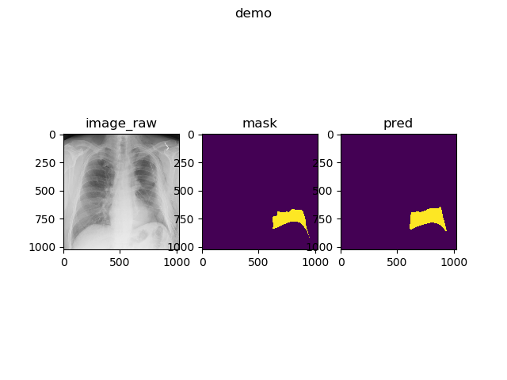
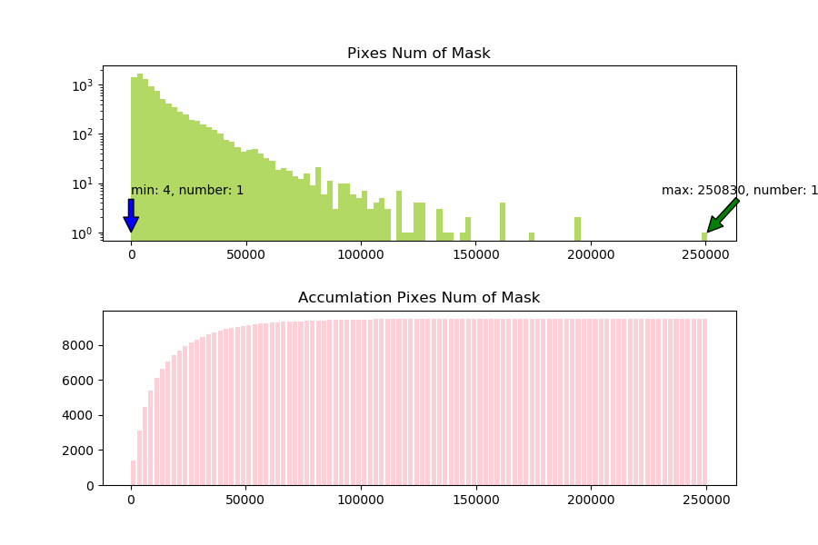

# SIIM-ACR Pneumothorax Segmentation Competition In Kaggle


Code for [kaggle siim-acr-pneumothorax-segmentation](https://www.kaggle.com/c/siim-acr-pneumothorax-segmentation), 34th place solution.

## Requirements
* Pytorch 1.1.0 
* Torchvision 0.3.0
* Python3.7
* scipy 1.2.0
* Install [backboned-unet](https://github.com/mkisantal/backboned-unet) first
```
pip install git+https://github.com/mkisantal/backboned-unet.git
```
* Install image augumentation library [albumentations](https://github.com/albu/albumentations)
```
conda install -c conda-forge imgaug
conda install albumentations -c albumentations
```
* Install [TensorBoard for Pytorch](https://pytorch.org/docs/stable/tensorboard.html)
```
pip install tb-nightly
pip install future
```
* Install [segmentation_models.pytorch](https://github.com/qubvel/segmentation_models.pytorch)
```
pip install git+https://github.com/qubvel/segmentation_models.pytorch
```

If you encountered error like: `ValueError: Duplicate plugins for name projector` when you are evacuating `tensorboard --logdir=checkpoints/unet_resnet34`, please refer to: [this](https://github.com/pytorch/pytorch/issues/22676).

```
I downloaded a test script from https://raw.githubusercontent.com/tensorflow/tensorboard/master/tensorboard/tools/diagnose_tensorboard.py
I run it and it told me that I have two tensorboards with a different version. Also, it told me how to fix it.
I followed its instructions and I can make my tensorboard work.

I think this error means that you have two tensorboards installed so the plugin will be duplicated. Another method would be helpful that is to reinstall the python environment using conda.
```
## Segmentation Results

The followings are some visualizations of our results.

**Using only one model:**



There are three parts in the image above. The left part is patient's X-ray picture, the middle is the original mask, the right is our segmentation mask.

**Using five models ensemble**:


## How to run

### Clone Our Project

```bash
git clone https://github.com/XiangqianMa/Kaggle-Pneumothorax-Seg.git
cd Kaggle-Pneumothorax-Seg
```

### Prepare Dataset 
Download SIIM datasets from [here](<https://www.kaggle.com/c/siim-acr-pneumothorax-segmentation/data>) , unzip and put them into `../input` directory.  Structure of the `../input` folder can be like:
```
dicom-images-test
dicom-images-train
stage_2_images
stage_2_train.csv
train-rle.csv
```
 Delete some non-annotated instances/images:
```bash
cd dicom-images-test
rm */*/1.2.276.0.7230010.3.1.4.8323329.6491.1517875198.577052.dcm
rm */*/1.2.276.0.7230010.3.1.4.8323329.7013.1517875202.343274.dcm
rm */*/1.2.276.0.7230010.3.1.4.8323329.6370.1517875197.841736.dcm
rm */*/1.2.276.0.7230010.3.1.4.8323329.6082.1517875196.407031.dcm
rm */*/1.2.276.0.7230010.3.1.4.8323329.7020.1517875202.386064.dcm
```

Put `stage_2_sample_submission.csv` into `Kaggle-Pneumothorax-Seg` directory. Then，evacuate the following instructions to convert  original dcm files to jpg.

```bash
cd Kaggle-Pneumothorax-Seg 
python datasets/dcm2jpg.py
cd ../input/

mkdir train_images_all
cp train_images/* train_images_all/
cp test_images/* train_images_all/

mkdir train_mask_all
cp train_mask/* train_mask_all/
cp test_mask/* train_mask_all/
```

Create soft links of datasets in the following directories:
```bash
cd ../Kaggle-Pneumothorax-Seg/datasets/
mkdir SIIM_data
cd SIIM_data
ln -s ../../../input/train_images/ train_images
ln -s ../../../input/train_mask/ train_mask
ln -s ../../../input/test_images/ test_images

ln -s ../../../input/test_mask test_mask
ln -s ../../../input/test_images_stage2 test_images_stage2
ln -s ../../../input/train_images_all/ train_images_all
ln -s ../../../input/train_mask_all/ train_mask_all
```

### Data Analysis
Before our training, we can use `datasets_statics.py` to analyze the distribution of training data:
```bash
python utils/datasets_statics.py
```

You can get something like:



### Train

Use one gpu for Stratified K-fold:
```bash
CUDA_VISIBLE_DEVICES=0 python train_sfold_stage2.py
```

Use all gpu for Stratified K-fold:
```bash
python train_sfold_stage2.py
```

> The competition is divided into two stages, so if you want to run the code for the first stage, please run `python train_sfold.py`

Please note that, if you prepare to use deeplabv3+ model, please add `drop_last=True` to all DataLoader functions in datasets/siim.py.

### Tensorboard
After the training of model, we can use tensorboard to analyze the training curves.

#### Different Event Files
Tensorboard displays different event files:
```
tensorboard --logdir=name1:/path/to/logs/1,name2:/path/to/logs/2
```

For example, when the files in the checkpoints/unet_resnet34 folder are organized as following:
```
├── 2019-08-27T22-59-29
│   └── events.out.tfevents.1564306811.zdkit.25995.0
├── 2019-08-28T02-01-21
│   └── events.out.tfevents.1564324685.zdkit.25995.1
```

We can run:
```
cd checkpoints/unet_resnet34
tensorboard --logdir=name1:2019-08-27T22-59-29,name2:2019-08-28T02-01-21
```

#### One Event File
Tensorboard displays one event file:
```
tensorboard --logdir=/path/to/logs
```

For example, when the files in the checkpoints/unet_resnet34 folder are as follows
```
├── 2019-08-27T22-59-29
│   └── events.out.tfevents.1564306811.zdkit.25995.0
```

You can run:
```
cd checkpoints/unet_resnet34
tensorboard --logdir=2019-08-27T22-59-29
```

### Choose Threshold
```bash
python train_sfold_stage2.py --mode=choose_threshold2
python train_sfold_stage2.py --mode=choose_threshold3
```

After running this，the best threshold and the best pixel threshold will be saved in the checkpoints/unet_resnet34 folder

### Create Prediction Csv
```bash
python create_submission.py
```
After running the code, submission.csv will be generated in the root directory, which is the result predicted by the model.

### Demo
When you have trained and selected the threshold, you can use demo_on_val.py to visualize the performance on the validation set
```bash
python demo_on_val.py
```

It is important to note that this code is only suitable for testing the performance of the fold0, for complete cross-validation,
there is no handout datasets, so using this code can not measure the generalization ability of the model.

### Others
At the end of the first stage of the competition, the competitor released the test dataset labels for the first stage. 
So we wrote a code to measure the performance of our first stage model (using dice)
```bash
python test_on_stage1.py
```

## Results
### Old Submission.csv
|backbone|batch_size|image_size|pretrained|data proprecess|mask resize|less than sum|T|lr|thresh|sum|score|
|--|--|--|--|--|--|--|--|--|--|--|--|
|U-Net|32|224|w/o|w/o|w/o|w/o|w/o|random|||0.7019|
|ResNet34|32|224|w/|w/o|w/o|w/o|w/o|random|||0.7172|
|ResNet34|32|224|w/o|w/o|w/o|w/o|w/o|random|||0.7295|
|ResNet34|20|512|w/|w/o|w/o|w/o|w/o|random|||0.7508|
|ResNet34|20|512|w/|w/|w/o|w/o|w/o|random|||0.7603|
|ResNet34|20|512|w/|w/|w|w/o|w|random|||0.7974|
|ResNet34|20|512|w/|w/|w|1024*2|w/o|random|||0.7834|
|ResNet34|20|512|w/|w/|w|2048*2|w|random||115|0.8112|
|ResNet34 freeze|20|512|w/|w/|w|2048*2|w|random||107|0.8118|
|ResNet34 freeze|20|512|w/|w/|w/|2048*2|w|CosineAnnealingLR|0.45|164|0.8259|
|ResNet34 freeze|20|512|w/|w/ CLAHE|w/|2048*2|w|CosineAnnealingLR|0.47|208|0.8401|
|ResNet34 freeze|20|512|w/|w/ CLAHE|w/|2048*2|w|CosineAnnealingLR|0.40|225|0.8412|
|ResNet34 freeze|20|512|w/|w/ CLAHE|w/|2048*2|w|CosineAnnealingLR|0.36|-|**0.8446**|
|ResNet34 freeze/No accumulation|20/8|512/1024|w/|w/ CLAHE|512|2048*2|w|CosineAnnealingLR|0.48|210|0.8419|
|ResNet34 freeze/No accumulation|20/8|512/1024|w/|w/ CLAHE|1024|1024*2|w|CosineAnnealingLR|0.48|118|0.7969|
|ResNet34 freeze/No accumulation|20/8|512/1024|w/|w/ CLAHE|1024|1024*2|w|CosineAnnealingLR|0.30|172|0.7958|
|ResNet34 freeze/No accumulation|8|1024|w/|w/ CLAHE|1024|2048*2|w|CosineAnnealingLR|0.35|209|0.8399|
|ResNet34/No accumulation|20|768|w/|w/ CLAHE|1024|2048|w|CosineAnnealingLR|0.46|249(ensemble)|0.8455|

### New Submission.csv
|backbone|batch_size|image_size|pretrained|data proprecess|lr|loss function|thresh|less than sum|ensemble|sum|score|
|--|--|--|--|--|--|--|--|--|--|--|--|
|ResNet34/No accumulation|20|768|w/|w/ CLAHE|CosineAnnealingLR||0.46|2048|average|171|0.8588|
|ResNet34/No accumulation|20|1024|w/|w/ CLAHE|CosineAnnealingLR|BCE|0.306|2048|average|207|**0.8648**|
|ResNet34/No accumulation|20|1024|w/|w/ CLAHE|CosineAnnealingLR|BCE|0.328|1024|average|223|0.8619|
|ResNet34/No accumulation|20|1024|w/|w/ CLAHE|CosineAnnealingLR|bce|0.34|2048|None|224|0.8535|
|ResNet34(New)/No accumulation|20|768|w/|w/ CLAHE|CosineAnnealingLR|bce|0.5499|2048|None|172|0.8503|
|ResNet34(New)/No accumulation|20|1024|w/|w/ CLAHE|CosineAnnealingLR|bce|0.3800|1792|None|228|0.8505|
|ResNet34(New)/No accumulation|20|1024|w/|w/ CLAHE|CosineAnnealingLR|bce+dice+weight|0.72|1024|None|195|0.8539|
|ResNet34(New)/No accumulation|10/6|1024|w/|w/ 0.4CLAHE|CosineAnnealingLR(2e-4/5e-6)|bce+dice+weight|0.67|2048|TTA/None|207|**0.8691**|
|ResNet34(New)/No accumulation|10/6|1024|w/|w/ 0.4CLAHE|CosineAnnealingLR(2e-4/1e-5)|bce+dice+weight|0.75|1280|TTA/None|219|0.8571|
|ResNet34(New)/No accumulation|10/6|1024|w/|w/ 0.4CLAHE self|CosineAnnealingLR(2e-4/5e-6)|bce+dice+weight|0.75|1024|TTA/None|217|0.8575|
|ResNet34(new)/No accumulation|10/6|1024|w/|w/ 0.4CLAHE|CosineAnnealingLR(2e-4/5e-6)|bce|0.45|1024|TTA/None|236|0.8570|
|ResNet34/No accumulation|10/6|1024|w/|w/ 0.4CLAHE|CosineAnnealingLR(2e-4/5e-6)|bce|0.36|768|TTA/None|254|0.8555|
|ResNet34(New)/No accumulation/three stage|10/6/6|1024|w/|w/ 0.4CLAHE|CosineAnnealingLR(2e-4/5e-6/1e-7)|bce+dice+weight|0.67|2048|TTA/None|206|**0.8741**|

## MileStone
* 0.8446: fixed test code, used resize(1024)
* 0.8648: used more large resolution (516->768), and average ensemble (little)
* 0.8691: bce+dice+weight (matters a lot/1.21); TTA (matters little); In the first stage, the epoch was reduced from 60 to 40, and the learning rate was reduced to 0 at the 50th epoch. The second stage of learning is adjusted to 5e-6 (matters a lot); Change the data preprocessing mode, the CLAHE probability is changed to 0.4, the vertical flip is removed, the rotation angle is reduced, and the center cutting is added.
* 0.8741: three stage set: Load the weights of the second phase and train only on masked datasets.

## Tricks Tried
- [x] unet_resnet34(matters a lot)
- [x] two stage set: two stage batch size(768,1024 big solution matters a lot) and two stages epoch
- [x] epoch freezes the encoder layer in the first stage
- [x] epoch gradients accumulate in the second stage
- [x] data augmentation
- [x] CLAHE for every picture(matters a little)
- [x] lr decay - cos annealing(matters a lot)
- [x] cross validation
- [x] Stratified K-fold
- [x] Average each result of cross validation(matters a lot) 
- [x] stage2 init lr and optimizer
- [x] weight decay(When equal to 5e-4, the negative effect, val loss decreases and dice oscillates, the highest is 0.77)
- [x] leak, TTA
- [x] datasets_statics and choose less than sum
- [x] adapt to torchvison0.2.0, tensorboard
- [x] different Learning rates between encoder and decoder in stage2 (not well)
- [x] freeze BN in stage2 (not well)
- [x] using lovasz loss in stage2 (this loss can be used to finetune model) (not well)
- [x] replace upsample (interplotation) with transpose convolution (not well)
- [x] using octave convolution in unet's decoder (not well)
- [x] resnet34->resnet50 (a wider model can work better with bigger resolution) (not well)
- [x] move noise form augmentation (not well)
- [x] Unet with Attention (not test, the model is too big, so that the batch size is too small)
- [x] change from 5 flod to 10 fold (not well)
- [x] hypercolumn unet (not well)
- [x] Dataset expansion (not well)
- [x] Data expansion is used only in the 1/3/10 epoch in the first stage (not well)
- [x] deeplabv3+ (not work)
- [x] Recitified Adam(Radams) (not work)
- [x] three stage set: Load the weights of the second phase and train only on masked datasets(matters a lot，from 0.8691 to 0.8741)
- [x] the dice coefficient is unstale in val set (The code is wrong.WTF)